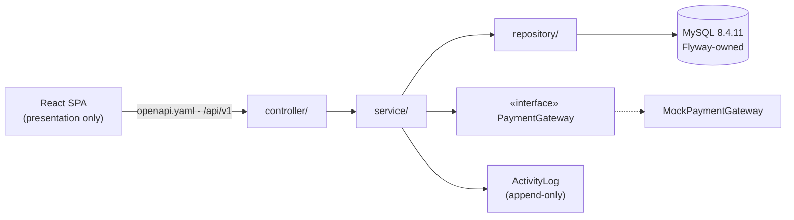

# Architecture Spine — StorageHub

## Design Paradigm

**Layered monolith (layer-first) phục vụ REST API dưới contract có version, tiêu thụ bởi React SPA.**

- **React SPA** — chỉ trình bày; không ra quyết định nghiệp vụ, không tự suy trạng thái.
- **Spring Boot layered** — `controller/` (HTTP ↔ DTO, validation entry) → `service/` (toàn bộ business logic, state transition, transaction) → `repository/` (Spring Data JPA).
- Một deployable backend, một schema MySQL; payment gateway mock đứng sau interface.

## Invariants & Rules

### AD-1 — Stack & FE/BE split `[ADOPTED]`

- **Binds:** all
- **Prevents:** FE/BE chọn stack lệch nhau; trượt về monolith JSP trái PRD §7.1
- **Rule:** BE = Spring Boot 4.1.1 / Java 21 LTS, REST JSON dưới `/api/v1`; FE = React 19.3 + Vite 8.3 SPA; DB = MySQL 8.4.11. FE/BE tách riêng, không server-render template.

### AD-2 — Contract-first API

- **Binds:** toàn bộ API surface; FR-1…41
- **Prevents:** BE implement lệch kỳ vọng FE; big-bang integration cuối kỳ
- **Rule:** `contracts/openapi.yaml` (repo chung) là nguồn chân lý duy nhất của API. Đóng băng đầu mỗi sprint; muốn đổi thì PR vào contract trước, code sau. FE phát triển chống MSW sinh từ contract; BE endpoint phải khớp contract; demo E2E cuối sprint chạy trên API thật. springdoc-openapi (nếu dùng) chỉ render docs — cấm dùng bản generate từ code làm nguồn contract.

### AD-3 — Layer-first discipline

- **Binds:** toàn bộ backend code
- **Prevents:** logic rải rác qua controller/repository; các BE trộn 2 style tổ chức code
- **Rule:** Controller chỉ nhận HTTP, map DTO, gọi đúng một service. Mọi business logic và transaction boundary nằm ở service. Repository chỉ query. Cấm controller gọi thẳng repository; entity JPA không rời backend — API chỉ trả DTO. **Repository chỉ được inject trong cùng module; module khác đọc dữ liệu chéo qua service query method công khai (không đổi trạng thái); cấm denormalize trạng thái của entity thuộc module khác — đọc chéo luôn derive-on-read.**

### AD-4 — Backend độc quyền state & thời gian

- **Binds:** 7 state chart (Reservation, Contract, Addendum, Unit, Task, Ticket, Payment); FR-19/20/22/36
- **Prevents:** FE tự suy trạng thái (đặc biệt EXPIRED) từ ngày — hai nguồn sự thật lệch nhau
- **Rule:** Mọi state transition đi qua service method của module owner. Trạng thái phái sinh từ thời gian (EXPIRED, turnover buffer) được tính **on-read idempotent** trong service; API luôn trả state đã suy diễn xong; FE hiển thị nguyên văn, không tính lại. **Trạng thái suy diễn không bao giờ được persist ngược vào cùng trường trạng thái gốc — derived state trả trong DTO.** Mọi hệ quả của transition suy diễn theo thời gian (receipt forfeit FR-36, Unit flip, Contract → Closed, Activity Log, notification) do owner service thực hiện **exactly-once lazily tại lần đọc/đụng tới đầu tiên**, guarded bằng idempotency key (unique constraint); **cấm scheduled batch side-effect song song** — một đường duy nhất, không hai đường. **Superseded có đúng một nghĩa: bị thay thế bởi bản mới hơn trong chuỗi; thời điểm flip là khi bản thay thế có hiệu lực (addendum: sau thanh toán; re-draft: ngay khi bản mới sinh).**

### AD-5 — Auth & permission matrix

- **Binds:** FR-1…3, FR-37; NFR-4
- **Prevents:** trust-the-client; FE tự enforce quyền thật
- **Rule:** JWT Bearer, role trong claim, TTL 24h, không refresh token, logout = client drop token. Permission matrix Role × Permission cố định, enforce **server-side từng endpoint**; FE chỉ dùng role để render (ẩn/hiện menu). Password hash at rest (BCrypt). LOGIN/LOGIN_FAILED ghi Activity Log (FR-38). **Mỗi request qua filter kiểm tra `users.Status` còn active (cache ngắn) — token của tài khoản bị deactivate/lock/đổi role hết hiệu lực ngay, không đợi hết TTL.** **Đúng 3 endpoint public không cần JWT: `POST /auth/login`, `POST /auth/register`, `POST /auth/forgot-password` (stub trả message generic, không email — FR-3).** **Giá trị nhạy cảm (Access Code) không nằm trong response danh sách; chỉ qua endpoint reveal có permission (cơ chế SensitiveValue, NFR-4).**

### AD-6 — Schema & data ownership

- **Binds:** 22 entity model V3; NFR-6
- **Prevents:** schema drift giữa môi trường; hai module cùng ghi một entity
- **Rule:** Schema thuộc về Flyway trong `backend/` (V1 = toàn bộ model V3); cấm DDL tay, cấm hbm2ddl auto. **Owner của một entity là service class sở hữu repository của entity đó; module khác muốn ghi phải gọi event method công khai của owner service (vd `UnitService.apply(UnitEvent)`) — cấm set field / save repository entity ngoài owner, kể cả trong cùng transaction.** Ownership matrix:

| Entity | Owner service (duy nhất được ghi) |
| --- | --- |
| ROLES, USERS | `UserService` (register FR-2, provisioning FR-37, status/lock) |
| FACILITIES, ZONES, UNIT_TYPES, UNITS | `UnitService` (catalog + merge/retire/fix-status FR-26) |
| STAFF_ASSIGNMENTS | `StaffingService` (FR-27) |
| RENTAL_POLICIES, POLICY_RULES | `PolicyService` (FR-29/30) |
| RESERVATIONS | `ReservationService` — trọn vòng đời (booking/check-in/extension/checkout là phase của cùng module sau merge V3) |
| EXTENSIONS | `ExtensionService` |
| CHECKOUT_REQUESTS, SETTLEMENTS, INSPECTIONS | `CheckoutService` (FR-17/18/41) |
| CONTRACTS, CONTRACT_ADDENDUMS | `ContractService` (FR-10…13) |
| PAYMENTS | `PaymentService` (FR-8/9) |
| SUPPORT_TICKETS, ESCALATIONS | `TicketService` (FR-23…25) |
| TASKS | `TaskService` (FR-21/22) |
| NOTIFICATIONS | `NotificationService` — độc quyền ghi, gọi đồng bộ trong cùng transaction nghiệp vụ qua event có kiểu (`NotificationEvent` enum + deep-link registry đặt trong openapi.yaml, FE route phải khớp registry); cấm module tự INSERT notification |
| ACTIVITY_LOGS | `LogService` — ghi đồng bộ trong cùng transaction (không after-commit event); Action/EntityType là enum chung trong code (registry), khai báo bắt-buộc-reason theo loại action **tại registry**, không tại từng caller |

ActivityLog append-only: chỉ INSERT, không tồn tại đường write update/delete. **Chống double-booking (FR-5): Reserve chạy trong transaction có guard unique/optimistic trên (Unit, ngày) — hai khách cùng unit sát nhau chỉ một bên thắng, bên thua nhận 409 + toast gợi ý.** **Seed demo data là Flyway migration versioned riêng (V2__seed_demo), chỉ chạy profile `dev`, chứa đúng bộ mock chuẩn (Lan/Minh/Hằng/Tuấn/Nam; S-3/M-2/M-5; BK-1042/RT-0871/SR-0032/CT-1042/CT-1042-A1; policy v3) — tái lập được từ 0, không insert tay.**

**V1 Flyway deltas so với model V3 (chốt tại đây, theo thẩm quyền PRD §9.1):**

- Tiền: mọi cột tiền theo AD-7 `DECIMAL(15,0)` — **ghi đè `DECIMAL(18,2)` của model V3** (VND không có phần lẻ).
- `CONTRACTS`: nới 1—1 thành **1—N mỗi reservation** qua `SupersedesContractID` + cờ `IsLatest` — giữ FR-10 re-draft (bản cũ Superseded vẫn đọc được trong chuỗi); "đúng một hợp đồng gốc" nghĩa là đúng một bản `IsLatest`. (PRD §9.1 đã sync ghi chú 2026-09-22.)
- `POLICY_RULES.RuleType` giữ enum, thêm `TURNOVER_BUFFER` / `DISCOUNT` / `WAIVER_CAP` — không tạo field riêng trên `RENTAL_POLICIES`.
- `users.FacilityID` nullable (demo 1 facility; mở scoping đa facility cho Facility Manager nếu cần).
- `NOTIFICATIONS` thêm `CreatedAt DEFAULT CURRENT_TIMESTAMP` (UX group theo ngày).
- `ESCALATIONS` giữ `TicketID UNIQUE` — quy ước v1: mỗi ticket escalate đúng một lần.
- `INSPECTIONS.Item` enum `ACCESS_CARD / PADLOCK / CLEANLINESS / STRUCTURE` (chuẩn ERD); mapping với nhãn checklist UX chốt khi freeze openapi.
- Ảnh unit: **static asset FE** (`public/units/{code}.jpg`) — không thêm entity, giữ con số 22.

### AD-7 — Money & time wire format

- **Binds:** FR-6…9, 15, 16, 18, 29, 30, 36, 40, 41; NFR-1
- **Prevents:** precision/timezone drift giữa FE và BE
- **Rule:** Tiền VND = `BigDecimal` (Java) + `DECIMAL(15,0)` (MySQL) + JSON number, đơn vị đồng, cấm float/double; mọi phép tính tiền ở service. Thời gian lưu UTC, vận chuyển ISO-8601 kèm offset, FE hiển thị `Asia/Ho_Chi_Minh`. Format hiển thị `1.150.000 ₫` (NFR-1). **Mọi biên nghiệp vụ theo ngày (deadline ký 7 ngày, expiry FR-36, shift FR-27, due date) được đánh giá theo lịch `Asia/Ho_Chi_Minh`; cột ngày nghiệp vụ dùng `DATE`/`LocalDate` ngữ nghĩa ICT, timestamp dùng UTC `Instant` — quy đổi ở service, không so sánh thô ở query.**

### AD-8 — Error & list envelope thống nhất

- **Binds:** toàn bộ API
- **Prevents:** FE parse lỗi/list mỗi endpoint một kiểu
- **Rule:** Mọi lỗi HTTP theo một envelope duy nhất định nghĩa trong openapi.yaml (machine code + message human + field errors khi validation). Danh sách: offset pagination `{items, page, pageSize, total}`, **`page` 1-based**, mặc định 25 rows (FR-26/28/31). Enum vận chuyển dạng UPPER_SNAKE string; JSON field camelCase. **Envelope áp dụng cho CẢ lỗi tầng security — cài `AuthenticationEntryPoint` / `AccessDeniedHandler` trả đúng envelope (401/403 không lọt body mặc định của Spring). Mọi operation trong openapi.yaml liệt kê đầy đủ response 4xx kèm machine code; business-rule block (FR-5 unit bị chiếm, FR-27 conflict) = 409 + envelope; filter/sort param kebab-case, định nghĩa trong contract.** Blocked-transition (snap-back FR-22) có payload cấu trúc: guard nào vi phạm + tên closing step còn thiếu — FE render toast từ dữ liệu này, không parse message người đọc. **Ngoại lệ duy nhất khỏi JSON: download CSV (FR-31, P2) trả `text/csv` + UTF-8 BOM cho Excel, sinh on-request, không lưu file.**

### AD-9 — Payment gateway sau interface

- **Binds:** FR-8, FR-9; NFR-5
- **Prevents:** logic mock payment rải vào controller/UI; khó thay gateway
- **Rule:** Thanh toán đi qua interface `PaymentGateway` với đúng một impl `MockPaymentGateway` deterministic (kết quả quyết bởi tham số test). FE không bao giờ tự quyết kết quả payment — chỉ hiển thị trạng thái từ API. **Trạng thái Payment là state machine của `PaymentService` duy nhất; đủ 5 trạng thái theo state chart được persist. Tham số outcome là cấu hình server-side của `MockPaymentGateway` (profile dev) — không bao giờ là field trong API request. Mọi mốc thời gian (QR expiry ~5 phút, processing timeout) do BE quyết định on-read — FE chỉ hiển thị đồng hồ đếm từ giá trị server trả; spinner local của modal Processing được phép và không coi là "quyết kết quả". Processing cố định ~1,5–2s cho demo ổn định (NFR-5).**

### AD-10 — File storage & serving (ảnh bản ký) `[ADOPTED 2026-09-22]`

- **Binds:** FR-11, FR-12, FR-13; NFR-4
- **Prevents:** ảnh chữ ký truy cập được không đăng nhập; FE chờ base64 trong khi BE trả URL (gãy integration cuối sprint)
- **Rule:** Ảnh bản ký (contract + addendum) upload qua endpoint riêng (multipart `POST /api/v1/attachments`), lưu tại đường dẫn backend quản lý (`backend/storage/`, gitignore), phục vụ về FE **chỉ qua controller stream đã qua JWT + permission check** (customer của rental đó, staff, manager). Cột `*PhotoUrl` chỉ lưu **API path tương đối** (`/api/v1/attachments/{id}`), do đúng một owner service ghi (`ContractService`). Cấm static resource mapping công khai; cấm base64 trong DTO list.

### AD-11 — Pricing single-source `[ADOPTED 2026-09-22]`

- **Binds:** FR-6, FR-7, FR-10, FR-15, FR-16, FR-29/30, FR-31, FR-40; NFR-1
- **Prevents:** Unit Detail / Booking Summary / Contract / Receipt / KPI ra 5 số khác nhau từ cùng một booking
- **Rule:** Toàn bộ con số tiền sinh ra từ một **`PricingEngine`** duy nhất đọc policy theo đúng một quy tắc resolve: phiên bản hiệu lực **tại thời điểm Booking Summary, snapshot vào reservation**; contract auto-draft, check-in 100% rent, extension fee, receipt **dùng lại snapshot đó** — không tính lại theo policy mới. Report chỉ được tổng hợp từ receipt/payment đã ghi, cấm tính lại từ term; "deposits held không phải revenue" (FR-31) tính từ PAYMENTS theo purpose.

### Dependency direction (luật di chuyển phụ thuộc)



Không ai bỏ tầng: SPA không gọi service/repository; controller không gọi repository; chỉ service ghi DB và gọi gateway.

## Consistency Conventions

| Concern | Convention |
| --- | --- |
| Naming | REST danh từ số nhiều kebab-case (`/api/v1/unit-types`); class theo feature trong từng layer (`ReservationController/Service/Repository`); DTO `XxxRequest`/`XxxResponse`; FE component PascalCase, hook `useXxx`, API client hàm đặt theo resource; JSON field camelCase |
| Data & formats | ID Long → JSON number; ngày ISO-8601 kèm offset; tiền theo AD-7; enum UPPER_SNAKE; error/list envelope theo AD-8 |
| State & cross-cutting | Validation = Bean Validation trên DTO; state machine chỉ ở service (AD-4); ghi ActivityLog qua `LogService`; config qua `application.yml` + profile `dev`/`prod`; FE: server-state bằng TanStack Query, UI-state cục bộ; role check FE chỉ để render |
| FE states & forms (NFR-8) | Skeleton khớp layout (không layout shift); empty state = factual + echo filter + đúng 1 CTA; block server hiển thị banner đầu form, không phải toast; Submit chỉ disable theo missing required; guard unsaved-changes khi rời màn có inline edit; bảng quản trị pagination 25 rows |
| Microcopy (NFR-7) | Mọi error/empty/toast theo khuôn 3 phần: chuyện gì xảy ra + hệ quả tiền/trạng thái + đúng 1 bước kế tiếp; nguồn chân trình bày = EXPERIENCE.md → Voice and Tone; register plain cho cả 5 role; cấm "!" và marketing verbs trong chuỗi hiển thị |
| A11y floor (NFR-2) | Mọi input có label; focus visible; thao tác chính chạy bằng keyboard (kanban có Move ngoài drag); status không chỉ phân biệt bằng màu; target ≥ 40px; focus trap trong modal/drawer; mỗi màn P1 pass một lượt keyboard trước demo |
| Notification 2 kênh (FR-33/34) | Mutation thành công trả kèm `notification` object trong response → FE bắn toast từ response; bell/unread-count qua query polling riêng (TanStack `refetchInterval`), có endpoint nhẹ unread-count tách khỏi list full; Operations Monitor (P2, nếu build) polling 10–15s theo contract |
| Deep link | FE sở hữu route table — artifact trong `contracts/` ; BE chỉ ghi `NOTIFICATIONS.DeepLink` theo route đã chốt, relative path (`/rentals/{id}`); KPI drill-down (FR-31/32) encode filter/tab/period vào query params URL |
| Sensitive & secrets | JWT secret + DB credentials qua env vars, không commit; Access Code reveal theo AD-5; temp password (SYS-01) trả trong response đúng 1 lần — chấp nhận cho demo |
| Log boundary | Log kỹ thuật (level/format/stacktrace) = SLF4J/logback thường; ActivityLog nghiệp vụ chỉ qua `LogService` (AD-6) — không trộn |
| Contract print | Nút Print (FR-11/12) render từ `ContentSnapshot` bằng print view FE — không xây PDF service |

## Stack

*(verify web 2026-09-22 — Maven Central / npm registry / start.spring.io; code sở hữu ngay khi tồn tại)*

| Name | Version |
| --- | --- |
| Java (LTS) | 21 (Initializr default 17 — chủ động chọn 21 khi init) |
| Spring Boot (webmvc · data-jpa · security · validation · flyway · actuator) | 4.1.1 |
| springdoc-openapi-starter-webmvc-ui | 3.1.1 — docs-only, cấm sinh contract (AD-2); nếu hỏng thì serve Swagger UI trực tiếp từ `contracts/openapi.yaml` |
| MySQL (+ `flyway-mysql` — bắt buộc từ Flyway 10+) | 8.4.11 LTS |
| React | 19.3.0 |
| Vite | 8.3.0 |
| TypeScript | theo create-vite template hiện hành (~6.0.x) — quyết TS/JS tuần 1 (Deferred) |
| TanStack Query + Axios | current |
| MSW (Mock Service Worker) | current (dòng 2.x — API `http` handler, docs 2.x) |
| JUnit Jupiter + Mockito + AssertJ | 6.0.3 / 5.23.0 / 3.27.7 — bundle Spring Boot (dòng JUnit 6, không phải 5) |
| Vitest + React Testing Library | current (FE test) |

**Boot 4 gotchas khi init repo** (khác tutorial cũ): starter `web` đã đổi tên `webmvc`; test starter tách theo module (`-webmvc-test`, `-security-test`… — `@WithMockUser` cần `security-test`); Jackson 3 là mặc định (`tools.jackson`); Flyway cần dependency `flyway-mysql`.

## Structural Seed

```text
storagehub/
  backend/                                # Spring Boot 4.1.1 · Java 21
    src/main/java/com/storagehub/
      controller/   service/   repository/   entity/   dto/
      security/     config/    payment/PaymentGateway.java
                              payment/MockPaymentGateway.java
    src/main/resources/db/migration/      # Flyway — V1 = model V3 (22 entity) · V2__seed_demo
    src/main/resources/application.yml    # profile dev/prod · secrets qua env vars
    storage/                              # Ảnh bản ký runtime (AD-10, gitignore)
  frontend/                               # Vite 8.3 · React 19.3
    src/pages/  components/  api/  hooks/  lib/
    public/units/                         # Ảnh unit static asset (V1 delta)
                                            # api/ sinh/tuần tự theo contracts/openapi.yaml
  contracts/
    openapi.yaml                          # chân lý API duy nhất (AD-2)
    routes.yaml                           # route table FE — nguồn DeepLink BE
  docs/                                   # planning artifacts (đã có)
```

Môi trường dev: Vite devserver proxy `/api` → Boot `:8080`; MySQL local. Môi trường demo: OQ-2 còn mở (xem Deferred).

## Capability → Architecture Map

| Area (PRD §4) | FR | Lives in | Governed by |
| --- | --- | --- | --- |
| Auth & Account | FR-1…3 | `Auth*` + `security/`; FE Login/Register/Forgot | AD-5 |
| Catalog & Booking | FR-4…7, 36 | `Catalog*`, `Reservation*` (state chart) | AD-4, AD-7, AD-11 |
| Payment | FR-8…9 | `Payment*` + `PaymentGateway` mock | AD-9, AD-7 |
| Contract & Addendum | FR-10…13 | `Contract*` (state chart, chain, addendum) | AD-4, AD-6, AD-10 |
| Rental ops (check-in · extension · checkout) | FR-14…18, 41 | `ReservationService` (phase check-in) + `Extension*`, `Checkout*`/`Settlement*` | AD-4, AD-7, AD-11 |
| Cleaning & Unit guards | FR-19…20 | `UnitService` + `Task*` | AD-4 |
| Task Board kanban | FR-21…22 | `Task*`; FE Kanban board | AD-4 |
| Support tickets | FR-23…25 | `Ticket*` (severity, relocation) | AD-4 |
| Facility admin — FM role | FR-26…28 | `UnitService`, `Staffing*` (guards, conflict, activity log view) | AD-5, AD-6 |
| Policy & pricing — BO role | FR-29/30, 40 (+ RuleType `WAIVER_CAP` của FR-41) | `Policy*` (policy versioning) | AD-6, AD-7, AD-11 |
| Dashboards & Reports | FR-31…32 | read-only query services; FE chart pages; **KPI drill-down là P1**; Export CSV P2 | AD-8, AD-11 |
| Notifications (toast + bell) | FR-33…34 | `Notification*`; FE toast/bell; pull-based | AD-2, AD-6; realtime = Deferred |
| Customer anchor screens | FR-35 | FE pages (My Rentals, Check-in Pass, Support List) đọc API sẵn có | AD-2 |
| SysAdmin | FR-37…39 | `UserService`/`SysAdmin*` (provisioning, audit view); FE SYS-01/02 (mockup Batch 9) | AD-5, AD-6 |
| Cross-cutting (a11y · format · perf) | NFR-1…8 | envelope AD-8, a11y/microcopy/states = Conventions, ActivityLog AD-6 | AD-5…8 |

## Deferred

- **OQ-2 deploy demo** — (a) 1 jar Boot nhúng `frontend/dist` vào `static/` vs (b) docker-compose (mysql + api + nginx). Cả hai nhánh đều same-origin (không CORS) và đều cần **SPA fallback `/* → index.html`**; router (history mode) chốt cùng lúc. Chốt tuần 6–8; không đổi AD nào.
- **FE libs (component + dnd + chart)** — AntD / MUI / Tailwind+shadcn + dnd-kit + thư viện chart: chốt **tuần 1** theo 27 mockup; không chạm contract. Không story FE nào dựng shared component trước lúc chốt.
- **TypeScript cho FE** — quyết **tuần 1, cùng buổi với component library** (tránh trộn .ts/.jsx); seed theo template create-vite (~6.0.x); nếu 2 FE chưa học TS → JS, contract và các AD không đổi.
- **Realtime notifications** (websocket/SSE) — pull-based đủ demo (Conventions); nâng cấp chỉ khi còn dư thời gian.
- **CI/CD workflow chi tiết** — theo monorepo; chốt khi dựng repo.
- **Chiến lược test & tool E2E** (Playwright?) — quyết ở sprint planning; unit stack đã pin 2 bên (JUnit/Mockito/AssertJ · Vitest/RTL).
- **Backup / monitoring / restore** — bỏ qua có chủ đích (capstone 8 tuần, demo 1 facility); health check duy nhất: `/actuator/health`.
- **Sprint/story breakdown + đội hình lane** — đã làm 2026-09-22: `Sprint_Backlog.xlsx` (3 sprint × 2 tuần, 33 US, BE: An/Phúc/Huy — FE: Phú/Tuấn Anh).
